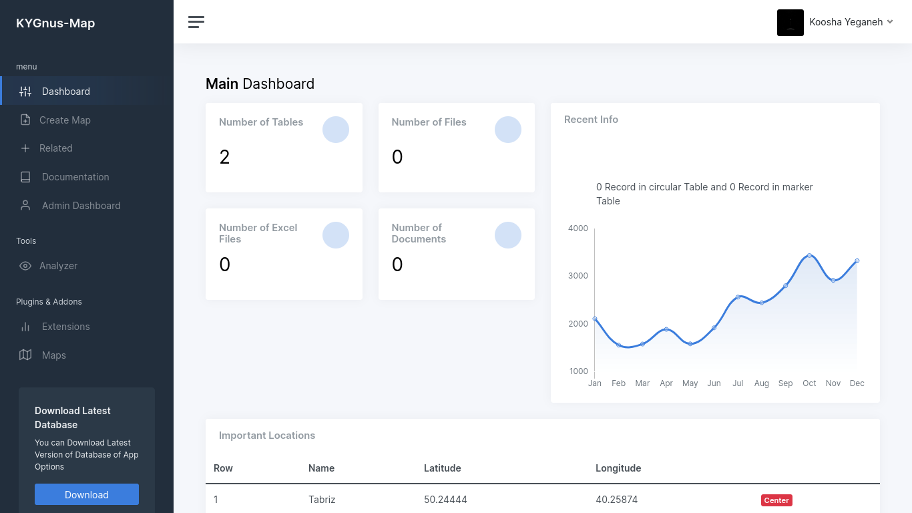

# KYGnus_Mapper
Easly Create Map and Some Other Features

# basic Requirements

1- Linux : I Test App in **Fedora35** and **Ubuntu22.04**  
2- MariaDB  
3- Python & pip  

# Install

> First Install mariadb and Create Database mapper 

MariaDB [(none)]> CREATE DATABASE mapper;

Then Just Run KYGnus_Map_installer with sudo

$ sudo **./KYGnus_Map_installer**

# Uninstall

$ sudo **./KYGnus_Map_uninstaller**
