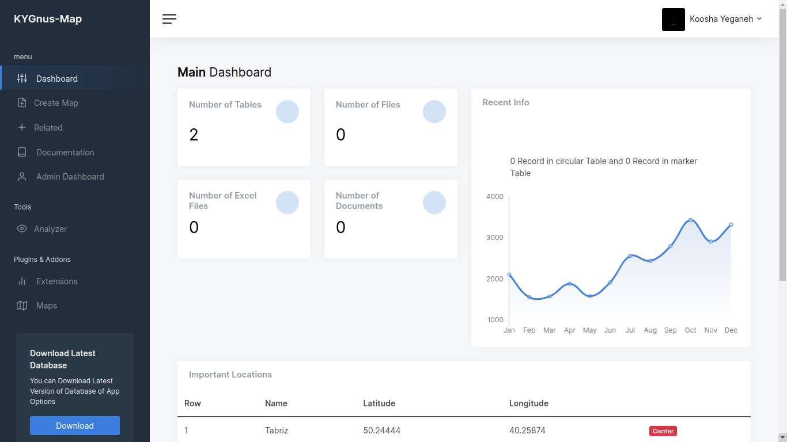

# KYGnus_Mapper
Easly Create Map and Some Other Features


<br><br>


- [Basic Requirements](https://github.com/KooshaYeganeh/KYGnus_Map#basic-requirements)
- [Install](https://github.com/KooshaYeganeh/KYGnus_Map#install)
- [Remove](https://github.com/KooshaYeganeh/KYGnus_Map#remove)
- [Docker](https://github.com/KooshaYeganeh/KYGnus_Map#docker)
    - [Download](https://github.com/KooshaYeganeh/KYGnus_Map#download)
    - [Build](https://github.com/KooshaYeganeh/KYGnus_Map#build)
    - [Run](https://github.com/KooshaYeganeh/KYGnus_Map#run)


## basic Requirements

2- MariaDB <br />
**OpenSuse:**  
`sudo zypper install mariadb-server`<br /><br />
3- Python & pip <br />  
`sudo zypper install python311`


Note: In order to be able to upload Excel, the format of the entered information must be as follows:

Map Style: "Latitude", "Longitude", "Name"


## Install

**For Install App Follow the steps below:** 

**1-Change Directory to /tmp and Download File From GitHub**

```
cd /tmp && wget https://github.com/KooshaYeganeh/KYGnus_Map/archive/refs/heads/main.zip && unzip main.zip && mv KYGnus_Map-main KYGnus_Map && cd
```

```
sudo mv /tmp/KYGnus_Map /home/$USER/kygnus_map && cd /home/$USER/kygnus_map && echo -e "\n The software directory was placed in the correct path [ OK ]"
```


**2-Test the pip Package Manager and then Install the packages**

First First, we check that the pip is installed correctly on the system, then Install packages

```
sudo pip install -r requirements.txt
```


**3- Create database in mariaDB**  
*Note : if Mariadb Not installed on system Install it*  
[For more Information About Install mariaDB on Fedora35](https://docs.fedoraproject.org/en-US/quick-docs/installing-mysql-mariadb/)  
[For more Information About Install mariaDB on Ubuntu 20.04 ](https://www.digitalocean.com/community/tutorials/how-to-install-mariadb-on-ubuntu-20-04)  
[For more Information About Install mariaDB on OpenSuse: OpenSuse4Developers](https://github.com/KooshaYeganeh/OpenSuse4Developers)

Note : Installation of MariaDB in openSuse Same as ubuntu


**4- Create Database mapper in MariaDB**

```
mysql --execute="CREATE DATABASE mapper"
```


**Note :** *If the database is located in the local system, it is better to put the username and password of the database in the /etc/my.conf file so that it is easy to log in and work with the database.*


[client]
user = mysqluser
password = mysqlpassword

> change dbuser with your databaseuser and dbpassword with your database password in command below 

```
echo -e "[clinet-server]\n\n[client]\nuser=dbuser\npassword=dbpassword\n\n!includedir /etc/my.cnf.d" > /tmp/my.cnf
```


**5- Change config (config.py) File From Your Configurations**


**6- Run App For First Time**

Note : in openSUSE you Might see SELinux status Error,You should Install SELinux Packages : 

```
sudo zypper in restorecond policycoreutils setools-console
```
  
*Note: in RedHat Base systems Like Fedora You Don't Need chnage python command because in Default mode python Running python3 command.*


**7- copy service File in /etc/systemd/system Directory**

```
sudo cp KYGnus_Map.service  /etc/systemd/system 
```

**8- Enable Service File**

```
cd /etc/systemd/system/ && sudo systemctl enable KYGnus_Map.service && sudo systemctl start  KYGnus_Map.service && cd && echo "Service File [ OK ]"
```


**11- for Better Security You should Block 8080 port in Your system**

```
sudo firewall-cmd --permanent --zone=public --add-port=80/tcp
sudo firewall-cmd --reload
```


## Remove

```
rm -rvf /home/$USER/kygnus_map && mariadb --execute="DROP DATABASE mapper" && sudo rm /etc/systemd/system/KYGnus_Map.service
```


## Docker 

### Download

```
sudo pull docker pull kooshakooshadv/kygnus_map:v2
```

### Build

```
sudo docker build -t kygnus_map .
```

### Run

```
sudo docker run --rm -p 8080:80 kygnus_map
```